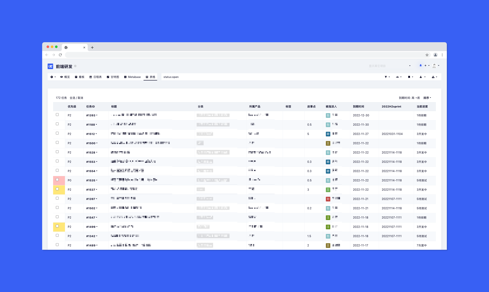

# Table View
A [Kanboard](https://github.com/kanboard/kanboard) plugin that provides a table view of your tasks in your project.   

## Features
1. Customizable table fields
2. Compatible with the plugins "Group_assigne" and "metaMagik"

## Getting started
1. Install from the Kanboard plugin manager directly. Or clone this repository to your plugin folder.
2. Copy and rename the file `config.default.php` to `config.php`, then edit it by following the instructions in the comments.

## Author
Greyaz

## License
License MIT
